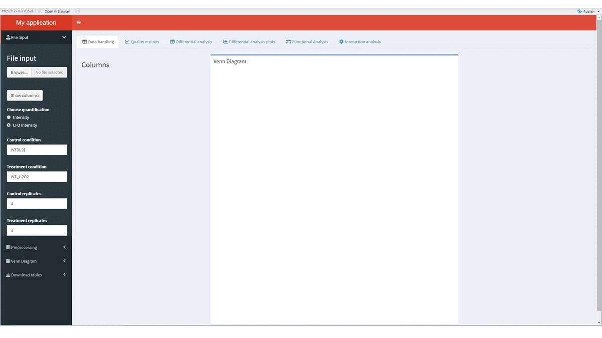

  
# Label Free Downstreaming Analysis 
En este repositorio se encuentra todo el código generado en el Trabajo Fin de Máster; Desarrollo de un flujo de trabajo en RStudio para la caracterización del papel de la proteína Prn1 en estrés oxidativo en *Candida albicans*.
 
 
Dicho trabajo abarca un *pipeline* para el análisis de datos de proteómica cuantitativa *label free* procedentes de MaxQuant cuyos archivos podemos encontrar en la carpeta "Pipeline" que contiene el archivo main.R eje conductor de las funcionalidades desarrolladas y los archivos dataprocessing.R quality_metrics.R, statisticalAnalysis.R, overviewfigures.R, enrichment.R y Network.R que contienen el conjunto de funciones implementadas. Por otro lado encontramos una interfaz gráfica a este *pipeline* desarrollada en el marco de *shiny app* cuyos archivos encontramos en la carpeta "App" siendo el archivo app.R el que contiene la estructura principal y el archivo functions.R el que contiene las funcionalidades desarrolladas.  
 
# Requisitos
- Archivo "ProteinGroups.txt" de MaxQuant. El *data set* utilizado en el presente trabajo se encuentra en la carpeta "data".

En la carpeta "data" encontramos un archivo "parameters.txt" con el conjunto de parámetros utilizados por MaxQuant para generar el *data set*, así como un documento en formato .pdf donde se da información acerca del significado de cada una de las columnas de dicho *data set*.
 
# Outputs
1. Quality metrics:
- Boxplots
- Scatter plots
- Pre/post imputation plots
- Histograms
- Principal Component Analysis
2. Overview figures:
- Volcano plots
- Heatmap
3. Enrichment:
- Dotplot
- Barplot
- Manhattan plot
4. Interactions:
- Interaction networks
5. Data:
- *data set* tras preprocesamiento
- *data set* tras análisis estadístico
- *data set* tras análisis funcional
# Créditos
Paquetes que lo hacen posible: dplyr, ggplot2, ggvenn, VIM, gplots, gprofiler2, igraph, plotly, limma, clusterprofiler, enrichplot, stringdb.

